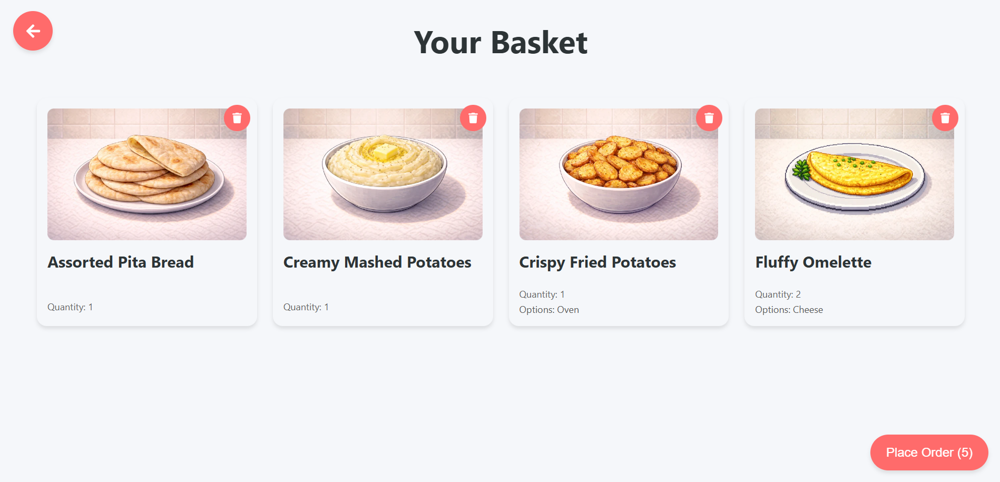

<h1>MN Kitchen</h1>

  
  

  

  

  

## What this is

MN Kitchen is a web app I use with my girlfriend to pick dishes, add them to a basket, and turn that basket into an order without rewriting the same message every time.

The About page in the app explains the motivation and what I plan to connect next.

Live app  
https://juuzoe.github.io/mn-kitchen/

## How it works

The menu data lives in one place and the basket state lives in one place. Menu cards can expand to show details. Adding to basket does not toggle the expanded card content. The basket page lets you adjust quantities and review the current selection.

The UI uses three routes

`/` for the menu  
`/basket` for the basket  
`/about` for background and motivation

## Motion and feedback

Animations are driven by Framer Motion and are triggered by real user actions such as opening a card, hovering, adding to basket, and showing a toast message. Motion is part of the component state, so the UI response stays in sync with what is on screen.

## Telegram bot plan

This project is built so the basket can be exported later and sent to a Telegram bot.

Intended flow

1) Open the site  
2) Add items to the basket  
3) Press a button that exports the basket as an order payload  
4) Send that payload to a Telegram bot endpoint  
5) The bot formats and posts the order in chat

## Forking and reuse

Forks are welcome. If you want your own version, replace the menu data and images, then deploy on your own GitHub Pages or any static host.

## Run locally

Requirements  
Node.js and npm

Install and start

`npm install`  
`npm start`

Build

`npm run build`

## Editing the menu

Menu items are stored in `src/data/menuItems.ts`. Images are served from `public/images` and referenced by the items. Nutrition macros and options live next to each item definition, so adding or changing a dish stays contained.

## Generating dish images

Dish images follow a fixed size and format so cards and layouts do not shift while scrolling.

When you add a new dish, generate an image via AI using a prompt in this shape

*600x400, webp, pixel-art like, similar background to (any picture from the project)*

In code, use *function name* to generate the prompt string you pass into your image generator. If you do not have this helper yet, add a small function that returns the exact prompt format you want and reuse it for every new dish.

Example prompt

600x400, webp, pixel art, same background style as existing dish images in the project, plate centered, dish readable, no text, no watermark

## Deployment notes

The live site is hosted on GitHub Pages under a repository path. If you fork and rename the repo, check the base path used by your build so routes and image assets keep resolving.
